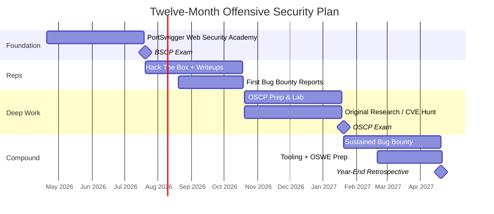
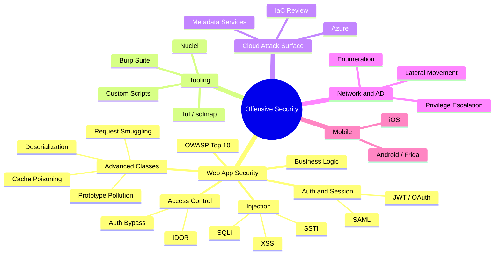

I've spent most of my career on the defensive side of security — cloud architecture, infrastructure as code, secure-by-design reviews, threat modelling, compliance mappings. The kind of work that keeps systems from being built on sand. I enjoy it and I'm not leaving it behind. But there's a gap between knowing how systems should be protected and knowing how they actually get broken, and I've wanted to close that gap for a long time.

So this year, I’m closing it. And I'm planning to document it.

This post is the commitment. Over the next twelve months I’m going deep on offensive security: web application testing, bug bounty, lab work, and research. I’ll publish what I learn as I learn it. The point isn’t to look polished; it’s to leave a trail.

## Why in public

Three honest reasons:

1. **Accountability.** A public timeline is harder to wriggle out of than a private one.
1. **Feedback.** Wrong takes on a blog get corrected faster than wrong takes in a notebook.
1. **Artifacts.** Everything I write becomes a reference for the next person who hits the same wall.

This is a side project done around a full-time role I enjoy — evenings, weekends, and hours that would otherwise be spent on something forgettable. Twelve months is a long time precisely because the pace has to be sustainable.

## The shape of the year

## The phases

### Months 1–3 · Foundation

The plan is simple: work through every lab on PortSwigger’s Web Security Academy and sit the BSCP exam. The Academy is the gold-standard web app security curriculum, and BSCP is its practical counterpart.

**What you’ll see published here**

- Weekly notes on whichever bug class I’m working through
- Two or three deep-dive posts on the topics that hit hardest (past students point to race conditions, OAuth, and request smuggling as the cliffs)
- A post-mortem after the BSCP exam — what the prep got right, what I’d do differently

**Measurable target:** BSCP passed by end of month 3.

### Months 4–6 · Reps

Knowing techniques is not the same as finding them fast. This phase is about pattern-matching speed: Hack The Box machines at two to three per week, and the first bug bounty reports.

**What you’ll see published here**

- HTB writeups, web-focused first, then broader
- My first bounty submissions — blow-by-blow of what I reported, what got accepted, what got marked duplicate, and what got rejected
- A "what I got wrong" post after every N/A — those are the most useful ones to read

**Measurable target:** 15+ HTB machines with public writeups, three or more accepted bounty reports.

### Months 7–9 · Deep Work

OSCP time. The cert stretches me past pure web into network and Active Directory, which is the point. Running in parallel: one piece of actual novel research — a CVE in an open-source project, a Burp extension that fills a real gap, or a deep-dive on a bug class that doesn’t have great public coverage yet.

**What you’ll see published here**

- OSCP prep notes and lab writeups as I go
- Either a published CVE with the disclosure writeup, or a released tool with a post explaining the gap it fills
- A post-mortem after the OSCP exam

**Measurable target:** OSCP passed by end of month 9, one piece of original research shipped.

### Months 10–12 · Compound

By the final quarter, the question shifts from "can I do this" to "how good can I get." Sustained bug bounty rhythm, maybe OSWE prep, and deeper research.

**What you’ll see published here**

- Ongoing bounty writeups
- More tooling, more templates
- A year-end retrospective: what worked, what didn’t, what I’d tell someone starting from where I started

**Measurable target:** active bug bounty profile with 5+ total resolved reports, 20+ total blog posts, one piece of tooling with real users.

## What you can actually track

I want this to be verifiable, not just aspirational. All of these will stay publicly updated:

- **This blog** — post count, categories, tag cloud
- **GitHub** — [marie-schmidt](https://github.com/marie-schmidt) — tooling, extensions, contributions
- **HackerOne & Bugcrowd** — profiles going live once my first report lands
- **Certification status** — listed on the [About](/about) page, updated as each exam is passed (or failed — those count too)

If this blog goes quiet for a month, the plan is slipping. Call it out in the comments.

## The skill map

A rough picture of the territory I’m trying to cover. Some of this I already know; most of it I don’t. The depth varies hugely by branch — the plan is to be unambiguously strong on the Web App Security branch by year’s end, and to at least reach competence on everything else.

## Ground rules I’m setting for myself

- **Ship ugly over polished.** A rough writeup published beats a perfect one that never leaves drafts.
- **Show the failures.** Duplicate reports, failed exploits, wasted hours on the wrong rabbit hole — those are the posts that actually help people.
- **Don’t skip the post-mortems.** The most important writeup in any phase is the one at the end, where I figure out what I got wrong.
- **Stay honest about pace.** If life happens, the timeline slips. The commitment is to the trail, not to the schedule.

## One year from today

The goal isn’t to become a pentester by Friday. It’s to be unambiguously competent at offensive web security in twelve months, with a public trail to prove it.

Let’s see how it goes. I’ll write the next post when the first PortSwigger labs are done — probably in a couple of weeks.

— Marie

