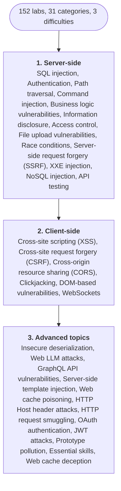

Foundation phase started. I opened the [PortSwigger Web Security Academy](https://portswigger.net/web-security) on Monday night with a raspberry iced matcha by my side and the kind of optimism that only lasts until you see the sidebar.

**Thirty-one topic areas. Roughly 152 labs. Three difficulty tiers. Zero opinion on what to do first.**
The Academy is famously comprehensive, which is why it's the gold standard, but "comprehensive" and "linear" are not the same thing. You can click into SQL Injection or Prototype Pollution or Web LLM Attacks with equal ease, and there's no "recommended next lab" button when you finish one. Which is fair: experienced people should be able to jump around. But I'm not experienced. I'm trying to build foundations, and foundations need an order.

So Episode #2 is about choosing one.

## The plan
After staring at the sidebar long enough to consider every wrong way to do this, the right way turned out to be the most boring one: use the order PortSwigger themselves recommend. Their [all topics page](https://portswigger.net/web-security/all-topics) groups every category into three tiers and tells you which to do first.

1. **Server-side topics first.** Easier to learn because you only have to reason about what is happening on the server. SQL injection, authentication, path traversal, command injection, business logic vulnerabilities, information disclosure, access control, file upload vulnerabilities, race conditions, and the rest of that family. PortSwigger explicitly recommends starting here, and within server-side they explicitly recommend starting with SQL injection.
2. **Client-side topics next.** XSS, CSRF, CORS, clickjacking, DOM-based vulnerabilities, WebSockets. The Academy frames these as building on the server-side skills you have already developed.
3. **Advanced topics last.** Insecure deserialization, server-side template injection, web cache poisoning, HTTP host header attacks, HTTP request smuggling, OAuth, JWT, GraphQL, Web LLM attacks, and friends. Heavier prerequisite load.

Within that order, the rule is one topic at a time, end to end, Apprentice through Practitioner through Expert, finished before the next one starts. First topic: SQL injection.

## Why this order
PortSwigger built the curriculum and they know the prerequisite graph better than I do. Their own framing is that server-side is easier to learn in isolation, client-side builds on server-side, and the advanced topics assume both. That is a defensible argument from the people who wrote the labs, and it saves me from inventing an ordering I would only second-guess later.

The within-topic rule (finish a topic completely before the next) is the personal half. I already have a strong tendency to jump from one shiny new thing to the next, drop the last one half-done, and then convince myself it was a phase. So the rule is the opposite: one topic, all the way through, until it is actually finished. Real mastery per bug class, and the momentum of completing something, rather than a shallow tour I would quietly drift away from.
- **Each topic:** end to end. Apprentice, then Practitioner, then Expert, in that order, in the same topic. No skipping ahead to the next topic because the current one got hard.
- **Expert labs:** done as part of closing out the topic, not deferred to a someday-pile. Some are genuinely brutal, but leaving them behind defeats the point.
- **Within a topic:** I work through the labs in the order PortSwigger lists them on each topic page, top to bottom.

## The tracker
The actual lab-by-lab tracker lives on its own page: [PortSwigger Progress](/posts/postswigger-progress/). That's the single source of truth, updated as I go, with status per lab and links to writeups as they land. This post stays a one-time writeup about the decision, so there's only ever one tracker to maintain.

For context, here's the high level: 31 categories, 152 labs, starting at 0 done. Everything else lives on the progress page.

I'll keep the progress page updated as I go, and link out to writeups as they land. Not every lab will get a dedicated writeup (the simple Apprentice ones probably don't need one) but anything that taught me something non-obvious will.

## Starting point
First topic: **SQL injection.** 18 labs, Apprentice through Practitioner through Expert. I am not touching another topic until all 18 are closed out.

First lab of that first topic:
1. SQL injection vulnerability in WHERE clause allowing retrieval of hidden data

Once SQL injection is fully done, the next server-side topic begins, following the list order from PortSwigger's all topics page: authentication, then path traversal, then command injection, then business logic vulnerabilities, then information disclosure, then access control, then file upload vulnerabilities, then race conditions, then the rest of the server-side set. Client-side and advanced topics come after server-side is completely finished.

## What's next here
The next post will either be (a) a technical writeup of the first non-trivial lab that surprised me, or (b) Episode #3 at the end of the SQL injection topic, whichever comes first. Technical writeups won't use the Episode convention; they'll have descriptive titles so they're findable by bug class.
If the tracker in this post doesn't update for two weeks, something's wrong with my schedule. Feel free to call it out in the comments.
