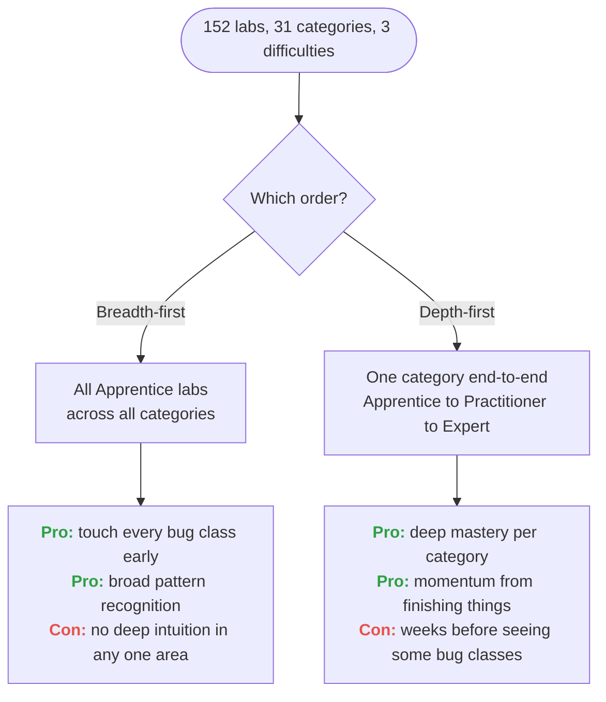

Foundation phase started. I opened the [PortSwigger Web Security Academy](https://portswigger.net/web-security) on Monday night with a raspberry iced matcha by my side and the kind of optimism that only lasts until you see the sidebar.

**Thirty-one topic areas. Roughly 152 labs. Three difficulty tiers. Zero opinion on what to do first.**
The Academy is famously comprehensive, which is why it's the gold standard, but "comprehensive" and "linear" are not the same thing. You can click into SQL Injection or Prototype Pollution or Web LLM Attacks with equal ease, and there's no "recommended next lab" button when you finish one. Which is fair: experienced people should be able to jump around. But I'm not experienced. I'm trying to build foundations, and foundations need an order.

So Episode #2 is about choosing one.

## Two defensible strategies
There are really two ways to work through the Academy, and they optimize for different things.

**Breadth-first:** do every Apprentice lab, across all 31 categories, before touching a single Practitioner. The logic: build a shallow mental model of every bug class before going deep on any. A beginner's best leverage is knowing what to *look* for; depth comes later. Downside: you spend weeks without ever feeling like you've mastered anything.

**Depth-first:** finish each category completely (Apprentice to Practitioner to Expert) before moving to the next. The logic: real mastery comes from going deep. Finishing a category feels good and teaches you patterns that don't emerge from surface-level exposure. Downside: you could spend six weeks on SQL Injection before ever seeing a CSRF or SSRF lab, which is weird if your goal is pattern recognition across bug classes.

## The approach I picked
Depth-first. I'm finishing each category completely, Apprentice through Practitioner to Expert, before moving to the next.
The honest reason is personal: I already have a strong tendency to jump from one thing to the next. New topic, new shiny rabbit hole, abandon the last one half-done. So instead of indulging that, I'm forcing the opposite. One category at a time, all the way through, until it's actually complete. Finishing the thing, and getting the satisfaction of that, before I'm allowed to move on.
- **Each category:** Work it end-to-end (Apprentice to Practitioner to Expert) following [onyxwizard's roadmap order](https://github.com/onyxwizard/portswigger-academy). That order groups related concepts well and has been used successfully by others, which is worth more than any ordering I could invent from scratch.
- **Expert labs:** Tackled as part of finishing each category, not deferred to the end. Some are genuinely brutal, but leaving them behind defeats the point of going deep.
- **The payoff:** Real mastery per bug class and the momentum that comes from completing something, rather than a shallow tour I'd quietly drift away from.

## Credit where it's due
The per-category ordering above comes from [onyxwizard/portswigger-academy](https://github.com/onyxwizard/portswigger-academy), a public lab tracker that lays out all 152 labs in a sensible learning order, tags them by difficulty, and includes emoji status markers for tracked progress. I'm not replicating it here; I'm following their ordering and linking to it.
If you're starting PortSwigger yourself, fork that repo before you do anything else. Save yourself the decision fatigue.

## The tracker
The actual lab-by-lab tracker lives on its own page: [PortSwigger Progress](/posts/postswigger-progress/). That's the single source of truth, updated as I go, with status per lab and links to writeups as they land. This post stays a one-time writeup about the decision, so there's only ever one tracker to maintain.

For context, here's the high level: 31 categories, 152 labs, starting at 0 done. Everything else lives on the progress page.

I'll keep the progress page updated as I go, and link out to writeups as they land. Not every lab will get a dedicated writeup (the simple Apprentice ones probably don't need one) but anything that taught me something non-obvious will.

## Starting point
First seven labs, all Apprentice, picked to hit as many bug-class categories as possible in the first sitting:
1. SQL injection vulnerability in WHERE clause allowing retrieval of hidden data
1. Basic clickjacking with CSRF token protection
1. Basic SSRF against the local server
1. Exploiting XXE using external entities to retrieve files
1. Reflected XSS into HTML context with nothing encoded
1. OS command injection, simple case
1. File path traversal, simple case
Seven labs across seven bug classes. By the end of week one I want all Apprentice SQL Injection, XSS, and Access Control labs done; those three alone cover about 40 labs and a big chunk of what actually shows up in bug bounty reports.

## What's next here
## What's next here
The next post will either be (a) a technical writeup of the first non-trivial lab that surprised me, or (b) Episode #3 at the end of the Apprentice pass, whichever comes first. Technical writeups won't use the Episode convention; they'll have descriptive titles so they're findable by bug class.
If the tracker in this post doesn't update for two weeks, something's wrong with my schedule. Feel free to call it out in the comments.
