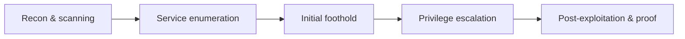

> **Executive summary** — Plain-language paragraph for a non-technical reader: what was tested, what was found, how bad it is, and the single most important fix. No jargon, no payloads.
{: .prompt-info }

## Scope & rules of engagement

- **Target(s):** `10.10.10.x` (hostname), in-scope hosts/ranges.
- **Environment:** e.g. HackTheBox / TryHackMe / personal lab — explicitly state this is an authorised, isolated environment.
- **Objective:** Foothold → privilege escalation → root/SYSTEM, capture proof.
- **Out of scope:** Anything explicitly off-limits.
- **Dates:** Start – end.

## Methodology

A short description of the overall approach (recon → enumeration → exploitation → privesc → post-exploitation) so the per-host sections have a frame.



## Findings summary

| # | Finding | Severity | Host | Status |
|---|---------|----------|------|--------|
| 1 | e.g. Unauthenticated RCE in web app | Critical | host01 | Exploited |
| 2 | e.g. Sudo misconfiguration | High | host01 | Exploited |

---

## Host: `host01` (10.10.10.x)

### Reconnaissance

Port/service scan results and what stood out.

```bash
nmap -sC -sV -oA scans/host01 10.10.10.x
```

| Port | Service | Version | Notes |
|------|---------|---------|-------|
| 22   | SSH     |         |       |
| 80   | HTTP    |         |       |

### Enumeration

Deeper digging into interesting services — directories, versions, creds, misconfigs.

### Initial foothold

How you got the first shell. Include the exact request/payload/command and the resulting access.

```bash
# exploit command / payload
```

**Proof of foothold:**

```
user@host01:~$ cat user.txt
<hash>
```

{: width="700" }

### Privilege escalation

Enumeration findings that led to escalation, the exploit/technique, and the result.

```bash
# privesc steps
```

**Proof of root/SYSTEM:**

```
root@host01:~# cat root.txt
<hash>
```

{: width="700" }

### Post-exploitation

Persistence, credential harvesting, lateral-movement opportunities, pivot points to other hosts.

---

## Remediation

Per-finding fixes, prioritised by severity.

1. **Critical — RCE:** patch/replace vulnerable component, validate input, ...
2. **High — sudo misconfig:** restrict sudoers, remove dangerous binaries, ...

## What I learned

Techniques, tooling, or mistakes worth remembering for the next box.

## Appendix

- **Tools used:** nmap, ffuf, linpeas, ...
- **Full command log:** link or collapsible block.
- **References:** exploit sources, CVEs, technique writeups.
