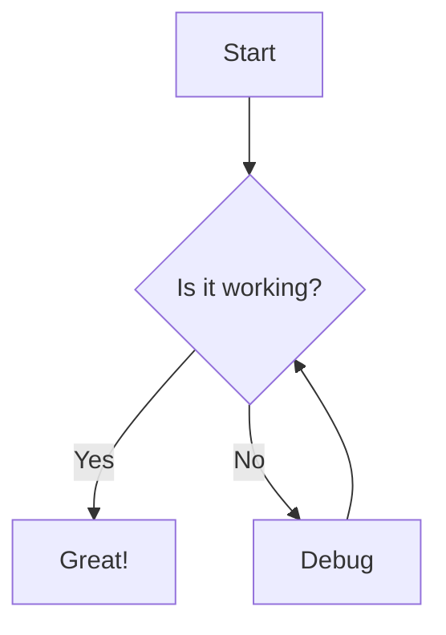

This tutorial will guide you on how to write a post in Astro-Chirpy. Even if you're familiar with Astro, it's worth reading as many features require specific frontmatter variables to be set.

## Naming and Path

Create a new file named `YYYY-MM-DD-TITLE.md`{: .filepath} and place it in the `src/content/posts/`{: .filepath} directory. The file extension must be `.md`{: .filepath} (Markdown).

For example:
- `src/content/posts/2024-01-15-my-first-post.md`{: .filepath}
- `src/content/posts/2024-01-16-another-great-article.md`{: .filepath}

## Front Matter

At the top of your post, you need to add frontmatter using YAML syntax:

```yaml
---
title: TITLE
date: YYYY-MM-DD HH:MM:SS +/-TTTT
categories: [TOP_CATEGORY, SUB_CATEGORY]
tags: [TAG]     # TAG names should always be lowercase
---
```

> Unlike Jekyll, Astro doesn't use layouts in frontmatter. The layout is determined by the content collection configuration.
{: .prompt-tip }

### Timezone of Date

To accurately record the release date of a post, provide the timezone in the `date` variable. Format: `+/-TTTT`, e.g. `+0800`.

Example:
```yaml
---
date: 2024-01-15T14:30:00+08:00
---
```

### Categories and Tags

The `categories` of each post can contain up to two elements, and `tags` can have zero to infinity elements.

```yaml
---
categories: [Blogging, Tutorial]
tags: [writing, astro, markdown]
---
```

### Author Information

Author information is configured in the `src/data/authors.yml`{: .filepath} file. You can specify an author in your post's frontmatter:

```yaml
---
author: geocine
---
```

To add a new author, edit `src/data/authors.yml`{: .filepath}:

```yaml
<author_id>:
  name: <full name>
  twitter: <twitter_of_author>
  url: <homepage_of_author>
```
{: file="src/data/authors.yml" }

You can also specify multiple authors:

```yaml
---
authors: [author1_id, author2_id]
---
```

> Including author information helps with SEO and social media sharing.
{: .prompt-info }

### Post Description

By default, the first words of the post are used as the description for SEO and preview cards. You can customize this:

```yaml
---
description: A concise summary of your post that appears in search results and social media.
---
```

The description will also appear under the post title on the post's page.

## Table of Contents

By default, the **T**able **o**f **C**ontents (TOC) is displayed on the right panel of the post. To disable it for a specific post:

```yaml
---
toc: false
---
```

## Comments

Comments are controlled globally through the site configuration. To disable comments for a specific post:

```yaml
---
comments: false
---
```

## Media

Images, audio, and video are collectively referred to as media resources in Astro-Chirpy.

### URL Prefix

You can define a URL prefix for media resources to avoid repetition:

- For CDN hosting, configure the `cdn` option in your site config
- For post-specific media paths, use `media_subpath` in frontmatter:

  ```yaml
  ---
  media_subpath: /posts/my-post-images/
  ---
  ```
  {: .nolineno }

The final resource URL is composed as: `[cdn/][media_subpath/]file.ext`

### Images

#### Caption

Add italics to the next line of an image to create a caption:

```markdown

_Image Caption_
```
{: .nolineno}

#### Size

Specify width and height to prevent layout shift:

```markdown
{: width="700" height="400" }
```
{: .nolineno}

Abbreviated form (Chirpy v5.0.0+):

```markdown
{: w="700" h="400" }
```
{: .nolineno}

> For SVG images, you must specify at least the width.
{: .prompt-info }

#### Position

Control image alignment with classes:

- **Normal position** (left-aligned):

  ```markdown
  {: .normal }
  ```
  {: .nolineno}

- **Float to the left**:

  ```markdown
  {: .left }
  ```
  {: .nolineno}

- **Float to the right**:

  ```markdown
  {: .right }
  ```
  {: .nolineno}

> When using position classes, don't add captions.
{: .prompt-warning }

#### Dark/Light Mode

Provide different images for dark and light themes:

```markdown
{: .light }
{: .dark }
```

#### Shadow

Add shadow effect to images:

```markdown
{: .shadow }
```
{: .nolineno}

#### Preview Image

Add a hero image at the top of your post (recommended resolution: 1200 x 630):

```yaml
---
image:
  path: /path/to/image
  alt: image alternative text
---
```

Simplified version:

```yml
---
image: /path/to/image
---
```

#### LQIP

Low Quality Image Placeholders improve perceived performance:

For preview images:

```yaml
---
image:
  lqip: /path/to/lqip-file # or base64 URI
---
```

For normal images:

```markdown
{: lqip="/path/to/lqip-file" }
```
{: .nolineno }

### Video Files

Embed video files directly using Astro components or HTML:

```html
<video controls>
  <source src="/path/to/video.mp4" type="video/mp4">
  Your browser does not support the video tag.
</video>
```

### Audio Files

Embed audio files:

```html
<audio controls>
  <source src="/path/to/audio.mp3" type="audio/mp3">
  Your browser does not support the audio element.
</audio>
```

## Pinned Posts

Pin posts to the top of the home page (sorted by date):

```yaml
---
pin: true
---
```

## Prompts

Create styled prompts with different types: `tip`, `info`, `warning`, and `danger`:

```md
> Example line for prompt.
{: .prompt-info }
```
{: .nolineno }

## Syntax

### Inline Code

```md
`inline code part`
```
{: .nolineno }

### Filepath Highlight

```md
`/path/to/a/file.extend`{: .filepath}
```
{: .nolineno }

### Code Block

Create code blocks with triple backticks:

````md
```
This is a plaintext code snippet.
```
````

#### Specifying Language

Add syntax highlighting by specifying the language:

````markdown
```javascript
const greeting = "Hello, World!";
console.log(greeting);
```
````

````markdown
```python
def greet():
    print("Hello, World!")
```
````

#### Line Numbers

By default, all languages except `plaintext`, `console`, and `terminal` display line numbers. To hide them:

````markdown
```shell
echo 'No line numbers!'
```
{: .nolineno }
````

#### Specifying the Filename

Display a filename instead of the language name:

````markdown
```javascript
console.log("Hello");
```
{: file="src/scripts/hello.js" }
````

## Mathematics

Astro-Chirpy uses [**MathJax**][mathjax] for mathematical expressions. Enable it per post:

[mathjax]: https://www.mathjax.org/

```yaml
---
math: true
---
```

Then use the following syntax:

- **Block math** with blank lines:

  ```markdown
  $$
  E = mc^2
  $$
  ```

- **Equation numbering**:

  ```markdown
  $$
  \begin{equation}
    E = mc^2
    \label{eq:einstein}
  \end{equation}
  $$

  Reference equation \eqref{eq:einstein}
  ```

- **Inline math** (no blank lines):

  ```markdown
  The equation $$ E = mc^2 $$ is famous.
  ```

- **Inline math in lists** (escape first `$`):

  ```markdown
  1. \$$ E = mc^2 $$
  2. \$$ F = ma $$
  ```

## Mermaid

[**Mermaid**](https://github.com/mermaid-js/mermaid) creates diagrams from text. Enable it:

```yaml
---
mermaid: true
---
```

Then use mermaid code blocks:

````markdown

````

## Learn More

For more about Astro's content collections and Markdown features, visit:
- [Astro Content Collections](https://docs.astro.build/en/guides/content-collections/)
- [Astro Markdown Guide](https://docs.astro.build/en/guides/markdown-content/)

This Astro-Chirpy theme is based on the [Jekyll Chirpy theme](https://github.com/cotes2020/jekyll-theme-chirpy) by Cotes Chung.
